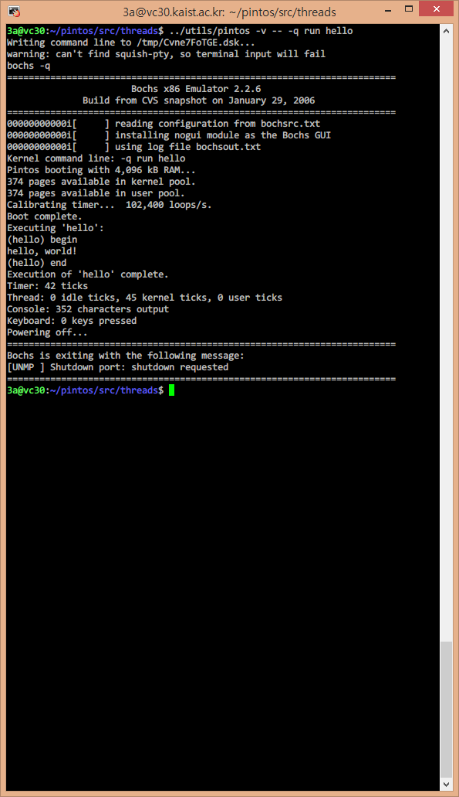

`src/tests/threads/` directory has tests for threads project. I can add
`hello.c` into the directory for actual test execution. It has one `printf` for
printing "hello, world!" thing.

`src/tests/threads/tests.h` has basic functions for tests and declaration of
`extern test_func`s for actual test. We declare `test_hello` extern:

``` c
extern test_func test_hello;
```

`src/tests/threads/tests.c` has `static const struct test tests[]` for the
mappings of the test name to actual `test_func` to execute. We add the following
line to it:

``` c
{"hello", test_hello},
```

`src/tests/threads/Make.tests` has a collection of test names and source for
tests. Only we have to do is adding 'hello' to `tests/threads_TESTS`, and
'tests/threads/hello.c' to `tests/threads_SRC`.
